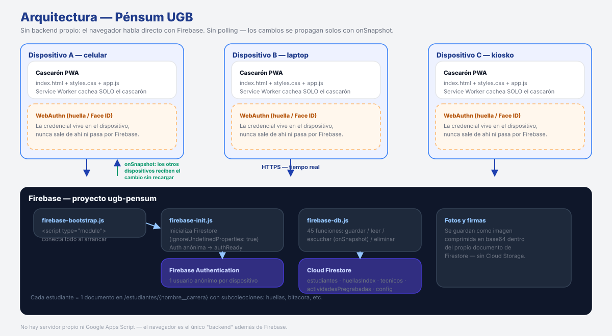

# UGB Pénsum — 100% Firebase (arranque desde cero)

`INDEX_FINAL.html` ya quedó conectado a Firebase. Google Sheets y Apps Script
quedaron completamente fuera del camino — ya no hace falta desplegar nada en
Apps Script para que esto funcione.

## Arquitectura



`INDEX_FINAL.html` habla directo con Firestore a través de `firebase-init.js`
(conexión + autenticación anónima) y `firebase-db.js` (leer/guardar/escuchar
datos). No hay polling: los cambios se propagan solos entre dispositivos con
`onSnapshot`. `horarios.html` es un visor aparte, sin dependencias de Firebase
ni de Sheets.

## Archivos y qué hace cada uno

| Archivo | Rol |
|---|---|
| `INDEX_FINAL.html` | Frontend. Login, notas, calendario, horario — todo habla directo con Firestore en tiempo real. |
| `horarios.html` | Visor de horario standalone, sin cambios (no depende de Sheets ni de Firebase). |
| `firebase-init.js` | Conexión a Firebase (Firestore + Auth anónima). Ya tiene las credenciales de `ugb-pensum`. |
| `firebase-db.js` | Todas las funciones de guardar/leer/escuchar datos en Firestore. |
| `Logotipo-horizontal-azul.png`, `logo2.png` | Logos que usa `INDEX_FINAL.html`. |
| `PLAN_MIGRACION_FIREBASE.md` | El plan original de 3 fases — ya ejecutado, queda como referencia. |
| `migrar-exportar.gs`, `migrar-importar.html` | **Ya no se necesitan** — eran para traer datos viejos de Sheets. Como se decidió arrancar todo nuevo, quedan sin usar. Se pueden borrar o guardar por si acaso; no afectan nada si no se tocan. |

## Qué cambió dentro de `INDEX_FINAL.html`

- `syncToSheets()` / `fetchFromSheets()` — mismos nombres de función (para no
  tener que tocar las demás ~3000 líneas del archivo que ya los llamaban),
  pero por dentro ahora escriben/leen Firestore en vez de Apps Script.
- El polling cada 3 segundos desapareció por completo. Ahora hay un listener
  en tiempo real (`onSnapshot`) — en cuanto se guarda algo en un dispositivo,
  aparece solo en los demás, sin esperar ni recargar.
- Login/contraseña — mismo hash SHA-256 de antes (nombre+contraseña), ahora
  guardado en el documento del estudiante en Firestore.
- El modal viejo de "Configurar Google Sheets" ya no existe.
- **Doble clic en el logo** (login o header) → verifica/inicializa la base
  de datos en Firestore, con el progreso en la consola del navegador (F12).
  También disponible desde el menú ☰ → "⚙️ Verificar base de datos".
- El botón "¿Dónde estoy?" ahora siempre usa `horarios.html` directo (mismo
  origen), en vez de pasar por Apps Script — así se evita el bloqueo de
  cookies de terceros que daba problemas antes.

## Cómo desplegarlo (arranque limpio)

No se necesita Apps Script para nada de esto. Se suben estos 5 archivos
juntos a cualquier hosting estático:

1. `INDEX_FINAL.html`
2. `horarios.html`
3. `firebase-init.js`
4. `firebase-db.js`
5. `Logotipo-horizontal-azul.png` y `logo2.png`

**Opción recomendada — Firebase Hosting** (mismo ecosistema, gratis para este tamaño de app):

```bash
npm install -g firebase-tools
firebase login
firebase init hosting   # elige el proyecto "ugb-pensum", carpeta pública = la que tenga estos archivos
firebase deploy
```

Esto da una URL tipo `https://ugb-pensum.web.app` — esa es la que se comparte
con los estudiantes.

**Alternativas igual de válidas:** GitHub Pages, Netlify, Vercel, o incluso
abrir `INDEX_FINAL.html` con doble clic desde la computadora (funciona local
también, ya que todo lo de Firebase se conecta por https, no por rutas locales).

## Primer uso

1. Abrir la URL del hosting (o el archivo local).
2. Doble clic en el logo → confirmar → revisar la consola (F12): debe decir
   "Base de datos lista".
3. Elegir carrera, crear la primera cuenta (nombre + contraseña) — como es
   la primera vez, el sistema la crea sola.
4. Guardar una nota y abrirlo en otro dispositivo/pestaña: debe aparecer sin
   recargar.

## Verificación

- [ ] Consola del navegador no muestra errores al cargar.
- [ ] Doble clic en el logo → log de inicialización visible.
- [ ] Cuenta nueva se crea y el login funciona.
- [ ] Guardar una nota se refleja en otro dispositivo sin recargar (esto es
      justo lo que antes fallaba).
- [ ] Firebase Console → Firestore → colección `estudiantes` va llenándose
      a medida que la gente usa el sistema.
- [ ] "¿Dónde estoy?" abre el horario sin pantalla en blanco.

## Pendientes / bugs abiertos ⚠️

> Estos son los tres temas que quedaron abiertos en la última sesión.
> No tengo el código actual de `INDEX_FINAL.html` / `firebase-db.js` a la
> vista en esta conversación, así que lo que sigue es diagnóstico y
> seguimiento, no una confirmación de que ya están resueltos.

- **Calendario (nota `undefined`)** — el fix que aparece en `firebase-init.js`
  (`initializeFirestore(app, { ignoreUndefinedProperties: true, ... })`) es
  correcto y en general **sí resuelve** el rechazo de Firestore cuando el
  campo `nota` de un evento nuevo llega como `undefined`. Con eso solo
  debería alcanzar. La única forma de que *no* alcance es si la función que
  guarda el evento del calendario hace alguna validación o `JSON.stringify`
  previo que ya truena antes de llegar a Firestore — eso no se ve en
  `firebase-init.js`, está en la función de guardado dentro de
  `INDEX_FINAL.html` o `firebase-db.js`. Si después de aplicar el fix el
  error sigue apareciendo, compartime esa función puntual (la que hace
  `.set()` o `.update()` del evento) y reviso qué más falta.
- **Asistencia no se registra en Firebase al enviarla** — bug abierto, sin
  diagnosticar todavía. Para revisarlo hace falta ver la función que dispara
  el guardado (el `onclick` del botón de marcar/enviar asistencia) y la
  función correspondiente en `firebase-db.js` que hace el `.set()`/`.add()`.
  Sin eso no puedo saber si es un problema de reglas de seguridad de
  Firestore, de un campo `undefined` (mismo patrón que el del calendario),
  o de que la función nunca se está llamando.
- **Menú hamburguesa — mejora pedida** — pendiente de confirmar si ya se
  aplicó. Quedó mencionado que se quería rediseñar a un panel lateral tipo
  drawer (con logo de la universidad, cuerpo con scroll y footer), similar
  a lo hecho en los otros archivos de UGB/UNIVO. Si ya está aplicado en
  `INDEX_FINAL.html`, avisame para actualizar esta sección; si no, lo retomamos.

Para dejar esta sección resuelta (y el resto del README con el inventario de
funciones 100% al día) lo más rápido es que subas la versión actual de
`INDEX_FINAL.html` y `firebase-db.js` — con eso reviso directamente qué
funciones existen, cuáles faltan documentar, y por qué falla la asistencia.

## A tu criterio

- Las reglas de seguridad de Firestore actuales (`allow read, write: if request.auth != null`)
  son mínimas — cualquier usuario autenticado anónimamente puede leer/escribir
  cualquier documento. Más adelante se podría restringir por `request.auth.uid`
  si se migra a contraseñas reales de Firebase Auth en vez del hash propio —
  no es urgente para arrancar. (Ojo: si el bug de asistencia resulta ser un
  problema de reglas, esto es lo primero que hay que mirar.)
- `codigo_gs_UGB.gs` (el backend viejo de Apps Script) y todo lo relacionado
  a Sheets queda completamente en desuso. Se puede archivar ese proyecto de
  Apps Script o dejarlo apagado, ya no lo toca nada de este sistema.
